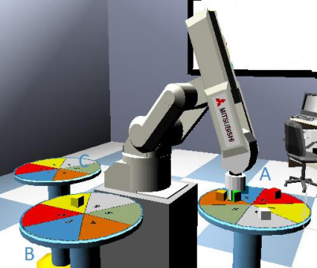

# melfabasic-robotic-arm

Project of CONT 428 Fundemantals Of Robotics Course
<br>
- Dogus University
- (12 May 2022)
- Teacher referance: <a href="https://www.linkedin.com/in/dilek-t%C3%BCkel-1b584221/?originalSubdomain=tr">Dilek Tükel</a>

## Assigment
### Design workspace consists of tables, robot and gripper, write melfabasic code and simulate it
<p align="center">
  <br>
</p>

```
Using RT toolbox, design a workcell consists of
  ➢ -3 tables
  ➢ -RV-7FL-D Robot

Robot working scenario
Robot carries cubes from table A to B or C according to digital input M_In(10111)
If input is ON, Robot carries cubes from A to C, else A to B.
Robot selects cubes according to M_In8(100), if the value is
  ➢ 1 it picks cube from position 1
  ➢ 2 it picks cube from position 2
  ➢ 3 it picks cube from position 3
  ➢ 4 it picks cube from position 4
  ➢ 5 it picks cube from position 5
  ➢ 6 it picks cube from position 6
Picks the cube and place it to A or B, the placement position will be the first empty place on the table A
or B.
You can empty table B according to M_In(5), You can empty table C, using M_In(6).
```

<br><b>Video Of Assigment:</b>  
<video src="https://github.com/user-attachments/assets/c7752617-02f1-47ae-bc2a-345ea2a2d3c9" width=180/></video>
